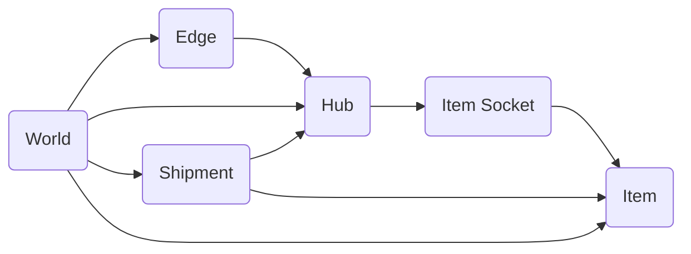
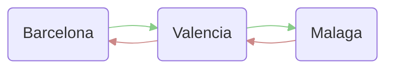

# Nomi World Operator

## The Problem
You’ve spent a long hard day in the dungeon slaying monsters. It wasn’t a great day for loot and all you collected were 10 rusty daggers. You make your way to the burly blacksmith and he smiles vacantly as he buys your daggers for 5 gold each, just like every day. Only another week of this and you’ll be able to buy the Great Axe he sells. As you head over to the tavern you try not to think about where he gets the gold. He stares without seeing as you sell him the same trash every night, then he tosses it onto the great mound of rusty equipment behind his shop. You wonder where it goes and how it all got into the dungeon in the first place.

## The Premise
The Nomi World Operator is an economic simulation designed to enrich your game world. It uses a graph model for identifying and quantifying locational disequilibria in the game world. These disequilibria create opportunities to make your game world come to life and for you to build engaging systems on top of. For example:
- If there is trade in the game, the Nomi World Operator can manage goods pricing at different locales.
  - Ore is cheaper at the mining camp and more expensive farther away
  - Players dumping loot into a single town receive worse prices as the market becomes saturated
  - Events causing shortages ripple through the game world
- Game states can change based on disequilibria
  - A town grows because a Player has kept it supplied with needed goods
  - A faction's only source of material is a rival faction, so they invade to secure it
  - Win wars like General Sherman
- NPC spawning based on Nomi World Operator conditions
  - Caravans spawn to transport goods according to the economic model
  - Raiders spawn along high trade routes
  - Spawn buildings to work down goods surplus
  - Lost caravans spawn lootables and the lost shipment impacts the world
  - Raw material mining camps can adjust to respond to Player created goods
- Disequilibria can be used to trigger quests
  - Deliver goods to ports in need
  - Escort caravans along trade routes
  - Fetch missing goods to town
  - Eliminate pirates along harried routes
  - Trigger or lift embargos

## A Mental Model of the Economic Model

Here's a flow chart of the key classes and which one has child elements:



#### World
The world is the top level container of the entire simulation. It contains all the elements necessary to function

### Hub
A Hub is a defined location within the Nomi World Operator. At different scales, a Hub could be a planet (as in Stellaris), a city (as in Civilization or Skyrim), or a specific shop (as in Stardew Valley). The important thing is that it either has needs or produces items. For example, `Hub A` may represent a lumber camp. Assume it has enough food and supplies and so there is no merchant there who will buy anything, but it produces `Wood`. It produces more `Wood` than it needs and this is the disequilibrium. There is too much wood at `Hub A` and it needs to go somewhere. Conversely, suppose we have `Hub B` that represents a hospital. Let’s assume it doesn’t produce anything, but it does consume `Medical Supplies`. This lack of `Medical Supplies` is the disequilibrium. There are not enough produced at `Hub B` and they must arrive from somewhere

### Edge
An Edge is a connection between two Hubs. Edges can represent any connection between Hubs. Examples could be roads, rivers, ocean paths, hyper space lines, teleport portals, or any other way goods can move between nodes. When Hubs and Edges are combined, you have the economic map of your game world.

### Item
An Item is any class of thing to be included in the Nomi World Operator simulation. This could be food, fuel, swords, cheese wheels, goons, soldiers, or anything else. Additionally, intangible things could also be included as items. You could have culture, faction points, development level, or research. Essentially if it is something that exists or is made in a certain location and moves, spreads, or travels, then it is a candidate for an Item. However, items that are fairly unique are poor candidates. You *could* include `Godly Plate of the Whale` in your economic model, but you would want a very specific reason for doing so. Fungible goods or those that can be commingled are going to be your bread and butter here.


### ItemSocket
An Item Socket represents the many-to-many relationship between Hubs and Items. Hub will have Item Sockets which determine the particular characteristics of the Item at that Hub. These characteristics include production and consumption rates. Importantly, they include target inventory levels. If `Hub A` does not have an Item Socket for `Square Hogs` then you can neither buy nor sell `Square Hogs` there.

### Shipment
A Shipment is the movement of Items from one Hub to another. It is the default mechanism for alleviating disequilibria in the simulation. In the Nomi World Operator simulation, shipments are tracked by position along routes and if the routes have a distance, then it will take time (in ticks) for the shipment to arrive. 

## Other Key Concepts

### Tick
The tick is the unit of time in the simulation. This may or may not be 1:1 with your game time

### LIP
LIP stands for Locational Item Price. It is the price for a specific Item at a specific Hub. For example, assume `Hub A` produces `Iron` while `Hub B` consumes it. The LIP for `Iron` at `Hub A` should generally be lower than `Hub B` because it is in surplus.

### GNP
GNP is an acronym for Global Net Production. This is the aggregate amount of production for an Item across all Hubs minus the aggregate consumption. If the GNP for an Item is not zero, then prices across the game world will creep up (if there is a negative GNP indicating a shortage) or creep down (if there is a positive GNP indicating a surplus). Your game design may cause the GNP to rise and fall (a drought may cause famine, a leviathan sighting may temporarily boost technology production, etc), but a GNP of zero is generally what you want.

Caveat: A GNP of zero does not mean you will not have localized problems, especially if your Edges connect your Hubs in a "stringy" fashion rather than a tightly connected network. Also large shipment costs on your Edges can increase the likelihood of localized problems.

Note on inflation: you may want prices to generally rise over time in your game. That is a *price specific concept* and the way to implement it is by raising base prices over time. Trying to implement inflation by adjusting production and consumption is a recipe for heartburn.

### Price Response Function
The price response function is a formula that maps the price as the dependent variable to the input of inventory. This represents the sensitivity of NPC life to this good. For example a shortage of `Food` might drive the price up very quickly whereas a shortage of `Hats` might not make as much difference. 
This is implemented in the Nomi World Operator using the following inputs.
- `b` **Base Price** : This is the price of the item at market satisfaction.
- `x` **Inventory Ratio** : The ratio current inventory to the target inventory, expressed as a percentage
- `s` **Swing Percentage** : The width of price movement around `Base Price` as a percentage
- `k` **K Exponent** : An indicator of how sensitive the price is to over or under supply

```math
price = -sb(x-1)^k+b
```

An example of `Swing Percentage` is that if s = 50%, then the minimum price is 50% the base and the max price is 150% the base. 
A note on `K Exponent`: in order to keep it a cubic function any input value will be rounded to 1/3 plus a multiple of 1/7.5 in the space of [1/3 , 5 ].

Graph link: https://www.desmos.com/calculator/w3uf7kmbl8


##### More... tbd

Leaving this here because it's cool and i'll want to use it later

